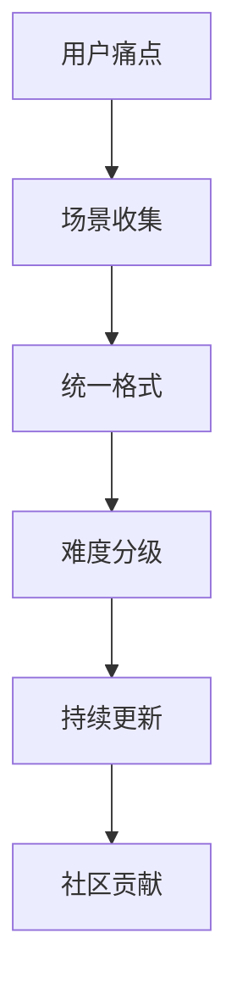

# Design Pattern Miner · 设计模式挖掘技能

> 从任何开源项目/文章中提取设计思想、实现逻辑和核心架构

---

## 🎯 核心功能

**输入**：
- GitHub 项目链接
- 微信文章链接
- 技术博客链接
- 官方文档链接
- 任何包含技术内容的 URL

**输出**：
- ✅ 核心设计思想
- ✅ 实现逻辑流程图
- ✅ 架构拆解
- ✅ 可复用方法论
- ✅ 关键代码片段（抽象化）
- ✅ 优缺点分析
- ✅ 适用场景

**目的**：
- 快速理解项目精华
- 提取可复用设计模式
- 避免逐行阅读源码
- 规避授权问题（提取思想，不复用代码）

---

## 🚀 使用示例

### 示例 1: 提取 GitHub 项目

**用户**：
```
分析这个项目的设计思想：https://github.com/AlexAnys/awesome-openclaw-usecases-zh
```

**AI 响应**：
```
好的！让我分析这个项目的设计思想...

---

# 设计思想提取报告

## 项目概述
- **名称**: awesome-openclaw-usecases-zh
- **核心目标**: 解决 OpenClaw 普及瓶颈——找到能改善生活的方式
- **Star 数**: 3.4k+
- **用例数**: 46 个

---

## 核心设计思想

### 1. 用例驱动设计模式

**思想**：不是教技能，而是教场景
```
传统方式：教用户如何配置 OpenClaw 技能
本项目：提供 46 个真实场景，用户直接复制用例
```

**可复用点**：
- 场景 > 技能 的设计理念
- 统一格式降低学习成本
- 难度分级（⭐⭐⭐）

---

### 2. 本地化适配策略

**思想**：全球项目，本地落地
```
原始项目：awesome-openclaw-usecases (英文)
本项目：awesome-openclaw-usecases-zh (中文 + 中国特色)
```

**适配内容**：
- 19 个中国特色用例（飞书、钉钉、企业微信）
- 中文文档和示例
- 国内工具生态集成

---

## 实现逻辑

### 核心架构


### 关键实现步骤
1. **场景发现**: 从社区收集真实使用场景
2. **格式统一**: 统一模板降低认知成本
3. **难度标记**: ⭐⭐⭐ 分级帮助用户选择
4. **持续迭代**: 根据反馈更新用例

---

## 可复用方法论

### 适用于你的项目
1. **场景优先**: 先定义用户场景，再设计功能
2. **降低门槛**: 统一格式 + 难度分级
3. **本地化**: 适配目标用户生态
4. **社区驱动**: 鼓励用户贡献用例

---

## 优缺点分析

| 优点 | 缺点 |
|------|------|
| 学习成本低 | 需要持续维护 |
| 场景真实 | 依赖社区贡献 |
| 易于复制 | 深度可能不够 |

---

## 适用场景

✅ 适合：
- 快速学习开源项目精华
- 提取设计思想用于自己的项目
- 避免逐行阅读源码

❌ 不适合：
- 需要完整理解项目实现细节
- 需要直接复用代码
```

---

### 示例 2: 提取微信文章

**用户**：
```
提取这篇文章的技术思想：https://mp.weixin.qq.com/s/xxxxx
```

**AI 响应**：
```
好的！让我提取这篇文章的技术思想...

---

# 技术思想提取报告

## 文章信息
- **标题**: ...
- **来源**: ...
- **发布日期**: ...

---

## 核心技术思想

### 1. ...

**思想**：...

**可复用点**：
- ...

---

## 实现逻辑

...

---

## 可复用方法论

...
```

---

## 📋 工作流程

### 标准流程（5 步）

1. **访问链接** - 打开 URL 获取内容
2. **内容分析** - 识别核心设计思想
3. **逻辑提取** - 拆解实现逻辑和架构
4. **抽象总结** - 提炼可复用方法论
5. **输出报告** - 生成结构化文档

### 输出模板

```markdown
# 设计思想提取报告

## 项目/文章概述
- 名称/标题
- 核心目标
- 关键数据（Star 数/字数等）

---

## 核心设计思想

### 1. 思想名称
**思想**：一句话总结
**详细说明**：...
**可复用点**：...

---

## 实现逻辑

### 架构图
```mermaid
...
```

### 关键步骤
1. ...
2. ...

---

## 可复用方法论

### 适用于你的项目
1. ...
2. ...

---

## 优缺点分析

| 优点 | 缺点 |
|------|------|
| ... | ... |

---

## 适用场景

✅ 适合：...
❌ 不适合：...
```

---

## ⚙️ 配置选项

### 提取深度
- **概要级** (默认): 10 分钟理解核心思想
- **标准级**: 30 分钟深入理解
- **详细级**: 1 小时完整拆解

### 输出格式
- **Markdown** (默认): 结构化文档
- **Mermaid**: 流程图 + 架构图
- **技能模板**: 可直接用于 CoPaw
- **全部**: 以上所有格式

---

## 🔐 授权说明

**重要**：本技能提取的是**设计思想和实现逻辑**，不涉及：
- ❌ 源码直接复用
- ❌ 版权内容复制
- ❌ 专利侵权

**符合**：
- ✅ 思想不受版权保护
- ✅ 学习参考用途
- ✅ 独立实现

---

## 📚 参考资源

- [Skill-Architect 方法论](../skill-architect/)
- [Skill-Creator 官方文档](../skill-creator/)
- [一泽 Eze: Skill 的哲学式设计](https://github.com/YizeEze/skill-philosophy)
